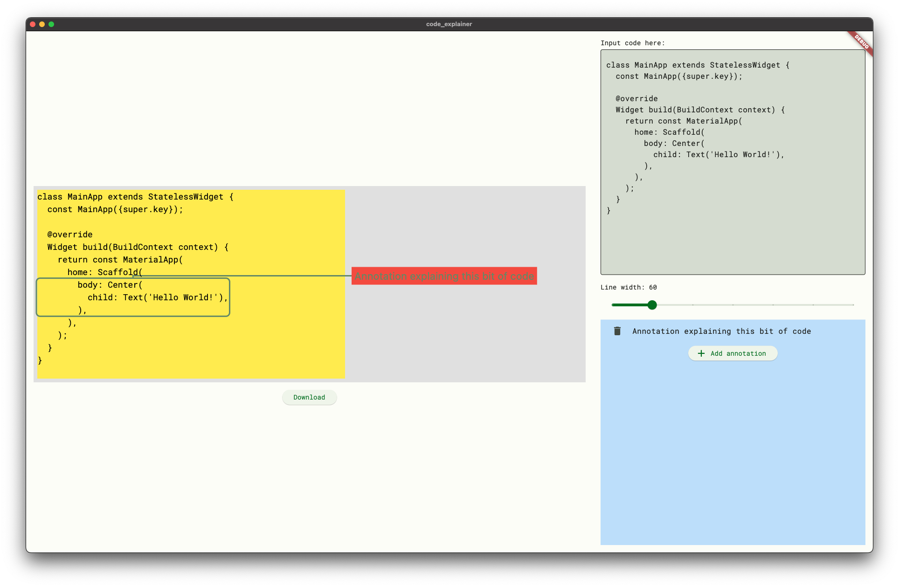

# code_explainer
An app for generating sharable code snippets with annotations to explain them.

## Why does this exist?
This project came about because while consuming tech content on the likes of Medium and Twitter (sorry, X), I found that screenshots generated from the likes of [carbon](https://carbon.now.sh) are good, they aren't great at explaining code. Even if they are littered with comments it's often not enough to truely explain specific parts in a specific line of code.

One of my favourite content creators is Andrea ([Code with Andrea](https://codewithandrea.com)) and in one of his articles he annotated his code which I found incredibly useful for understanding what was going on. Later I also [saw this video](https://twitter.com/_georgemoller/status/1693958546470096982?s=20) which everyone in the comments loved the format of (myself included).

The trouble with the above is that they are high effort to create so I wanted to make this for content creators and tutors to generate explanatory images and gifs with minimal effort.

This was also a great excuse to work with `TextPainter` which I hadn't done before.

## Status
It is hardly even a working prototype at this moment. Always welcome to PRs.

## TODO
- [ ] Make it look ~~nice~~ not s**t
- [ ] Prevent annotations from overlapping
- [ ] Syntax highlighting
- [ ] Customisable themes
- [ ] Animate and download as gifs
- [ ] Have work on web
- [ ] Annotate diffs